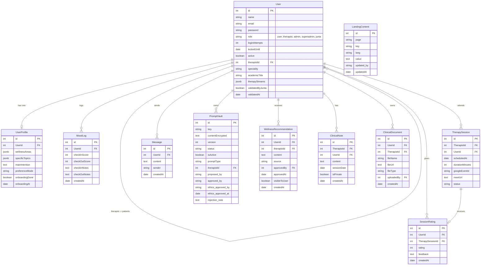

# Arquitectura de Elevation — Generada por Manus
> Fuente: Manus AI basado en prompt maestro de Elevation
> Validado: 31 de marzo de 2026

---

## Modelo de Datos (ERD)

---

## Arquitectura de la API

### `/api/user/*` — Perfil y progreso del usuario
- `GET /api/user/profile`
- `POST /api/user/onboarding`
- `PUT /api/user/preference`
- `GET /api/user/progress`
- `GET /api/user/recommendations`
- `GET /api/user/therapist`

### `/api/mood/*` — Emociones y chat
- `POST /api/mood/check-in`
- `POST /api/mood/check-out`
- `POST /api/mood/chat`
- `POST /api/mood/rate`

### `/api/therapist/*` — Panel del terapeuta
- `GET /api/therapist/patients`
- `GET /api/therapist/patients/:id`
- `GET /api/therapist/patients/:id/notes`
- `POST /api/therapist/patients/:id/notes`
- `GET /api/therapist/patients/:id/recommendations`
- `PUT /api/therapist/recommendations/:id/approve`
- `POST /api/therapist/sessions`
- `POST /api/therapist/prompt`

### `/api/admin/*` — Backoffice
- `GET /api/admin/users`
- `POST /api/admin/users`
- `PUT /api/admin/users/:id/role`
- `PUT /api/admin/users/:id/assign-therapist`
- `GET /api/admin/content/:page`
- `PUT /api/admin/content/:page`
- `GET /api/admin/metrics`
- `GET /api/admin/prompts`
- `PUT /api/admin/prompts/:id/technical-review`

### `/api/junta/*` — Junta Ética
- `GET /api/junta/therapists/pending`
- `PUT /api/junta/therapists/:id/validate`
- `GET /api/junta/prompts/pending`
- `PUT /api/junta/prompts/:id/ethics-review`
- `PUT /api/junta/manifesto`

---

## Lógica de contenido dinámico

1. **BD:** `LandingContent` con `(page, key, lang)` único
2. **Frontend:** fetch a `/api/content/:page?lang=es` al cargar
3. **Fallback:** si falla la API → usa `constants/defaults.ts`
4. **Backoffice:** admin edita → `PUT /api/admin/content/:page`
5. **Bilingüe:** query param `?lang=es` o `?lang=en`

---
*Generado por Manus AI · Validado: 31 de marzo de 2026*
